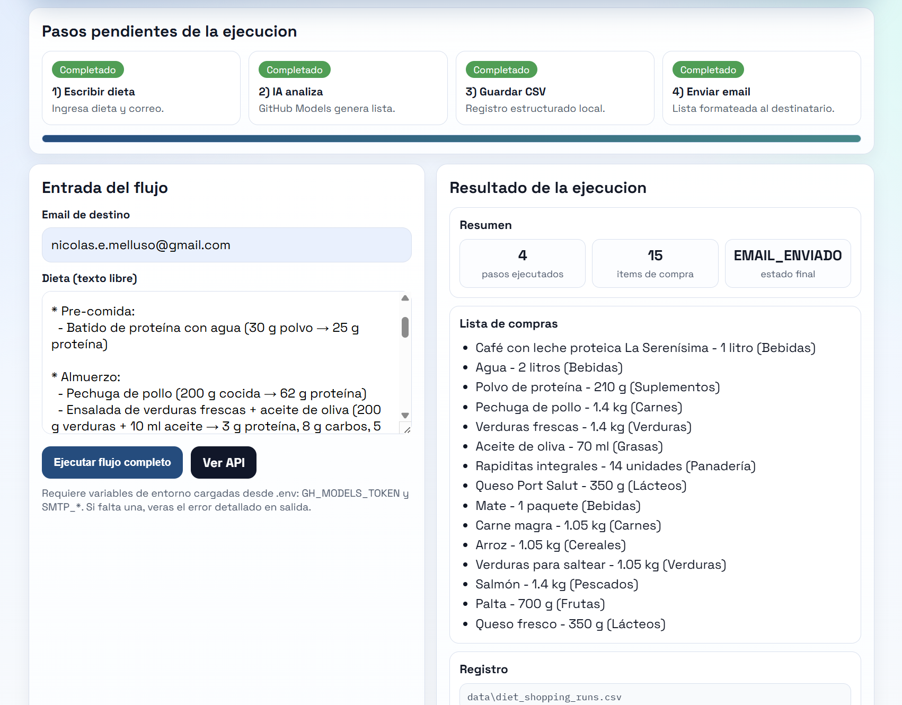

# n8x (panel de automatizacion con IA)

Proyecto para aplicar la leccion de low-code en un caso util:

1. escribir una dieta,
2. genera lista de compras con IA,
3. guarda datos estructurados en CSV,
4. envia el resultado por correo.



## Que incluye

- API con FastAPI
- Motor de workflows por pasos con tiempos por paso
- Registro de acciones reutilizables (nodos)
- Carga de workflows desde JSON
- Panel visual en /ui
- Barra de progreso en vivo + subpasos durante ejecucion
- Flujo principal dieta -> IA (GitHub Models) -> CSV -> Email
- Ejecucion sincrona y asincrona con estado de run

## Estructura

- `src/flow_chest/main.py`: API, UI y endpoints de runs async
- `src/flow_chest/engine.py`: motor de ejecucion y medicion por paso
- `src/flow_chest/actions.py`: acciones (GitHub Models, CSV, SMTP)
- `src/flow_chest/static/index.html`: panel visual con progreso en vivo
- `workflows/diet-shopping-email.json`: workflow principal
- `data/diet_shopping_runs.csv`: registro estructurado (se crea en runtime)
- `.env.example`: plantilla de configuracion

## Requisitos

- Python 3.10+

## Setup

```bash
python -m venv .venv
source .venv/Scripts/activate
pip install -r requirements.txt
pip install -e .
```

## Configuracion

1. Copia `.env.example` a `.env`.
2. Completa credenciales.

Valores recomendados para GitHub Models:

```dotenv
GH_MODELS_TOKEN=tu_token
GH_MODELS_MODEL=gpt-4o-mini
GH_MODELS_ENDPOINT=https://models.inference.ai.azure.com/chat/completions
```

SMTP:

```dotenv
SMTP_HOST=smtp.gmail.com
SMTP_PORT=587
SMTP_USER=tu_correo@gmail.com
SMTP_PASS=tu_app_password
SMTP_SENDER=tu_correo@gmail.com
```

Notas:

- `.env` se carga automaticamente al iniciar la app.
- En Gmail, usa app password (no la contrasena normal).

## Ejecutar

```bash
python -m uvicorn flow_chest.main:app --port 8010
```

UI:

- http://127.0.0.1:8010/ui

Docs:

- http://127.0.0.1:8010/docs

## Uso rapido (UI)

1. Abre /ui.
2. Completa email y dieta.
3. Ejecuta el flujo.
4. Mira progreso en vivo:
   - paso actual,
   - subpasos completados,
   - duracion por paso,
   - porcentaje total.
5. Verifica salida:
   - lista de compras,
   - estado final,
   - ruta CSV,
   - JSON crudo.

## API

Listar workflows:

```bash
curl http://127.0.0.1:8010/workflows
```

Ejecucion sincrona:

```bash
curl -X POST http://127.0.0.1:8010/run/diet-shopping-email \
  -H "Content-Type: application/json" \
  -d '{"input":{"diet_text":"desayuno avena y banana; cena pollo y ensalada","email":"tu-correo@dominio.com"}}'
```

Ejecucion asincrona (para barra de progreso/polling):

```bash
curl -X POST http://127.0.0.1:8010/run-async/diet-shopping-email \
  -H "Content-Type: application/json" \
  -d '{"input":{"diet_text":"desayuno avena y banana; cena pollo y ensalada","email":"tu-correo@dominio.com"}}'
```

Consultar estado de run:

```bash
curl http://127.0.0.1:8010/runs/<run_id>
```

## Troubleshooting

Puerto 8010 ocupado (Windows):

```powershell
powershell -NoProfile -Command '$conns = Get-NetTCPConnection -LocalPort 8010 -State Listen -ErrorAction SilentlyContinue; if ($conns) { $conns | ForEach-Object { Stop-Process -Id $_.OwningProcess -Force } }'
```

Error `unknown_model`:

- Usa `GH_MODELS_MODEL=gpt-4o-mini` o `gpt-4o`.
- Verifica token/permisos del endpoint.

## Como extender

1. Agrega una accion nueva en `ACTION_REGISTRY` en `src/flow_chest/actions.py`.
2. Crea un workflow JSON en `workflows/`.
3. Ejecuta por `/run/{workflow_id}` o `/run-async/{workflow_id}`.
